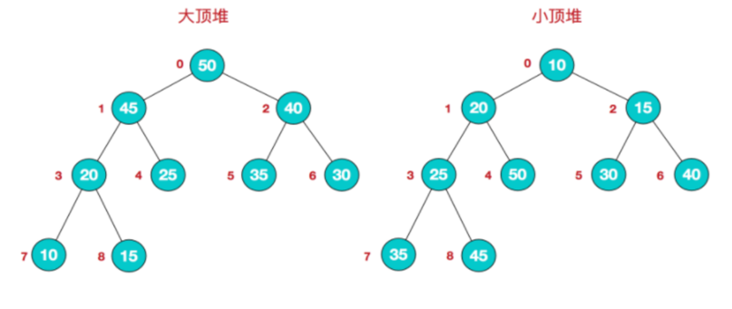
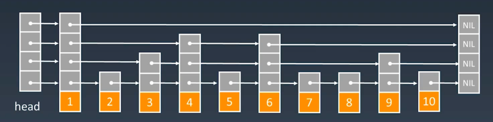

# 堆

* 大顶堆：每个结点的值都大于或等于其左/右孩子结点的值
* 小顶堆：每个结点的值都小于或等于其左/右孩子结点的值

# 跳表

* 基本思想：创建多级索引，空间换时间
* 查找、插入、删除时间复杂度：O(logn）

红黑树和跳表对比

* 在做范围查找的时候，红黑树比skiplist操作要复杂
* 红黑树的插入和删除操作可能引发子树的调整，逻辑复杂，而skiplist的插入和删除只需要修改相邻节点的指针，操作简单又快速
* 从算法实现难度上来比较，skiplist比平衡树要简单得多
* 查找单个key，skiplist和红黑树的时间复杂度都为O(log n)，大体相当
* 从内存占用上来说，skiplist每个节点包含1个指针，红黑树每个节点包含2个指针